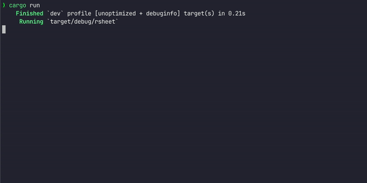
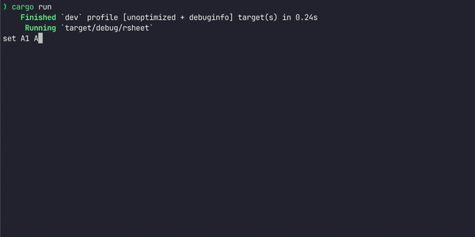
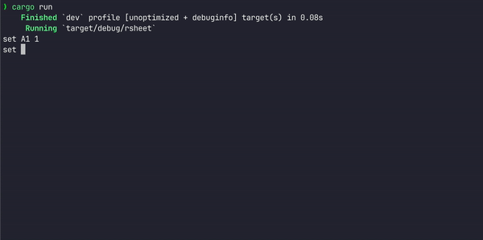

# Rust Multi-threaded Spreadsheet

## Basic Functionality

## Circular Dependency Handling

## Multi-layer Dependencies

---

## General

- It’s basically a dumbed-down google sheets
- Using library `rsheet_lib`
- **Stage 1:** get & set
- **Stage 2:** Using variables in calculations
- **Stage 3:** Multiple Readers and Writers (threading)
- **Stage 4:** Simple Dependency Changes
- **Stage 5:** Multi-Layered Dependencies
- **Stage 6:** Circular Dependencies

---

## Crate `rsheet_lib`

- 5 modules
    - `cell_value`: is Enum with int,  string, error, None. Is by default None
    - `cells`: convert between zero indexed column numbers and column names
    - `command_runner` : does Rhai interpretation for us
        - `find_variables` and `run` methods
    - `connect`: Manages user interaction ⇒ code for talking to and from connections (Reader and Writer type)
    - `reply`: Either `Value(String, CellValue)`, or `Error(String)`
- `start_server` module takes either a TCP connection or a terminal connection

---

## Tasks (My Approach)

- **Stage 1:** get & set
    - No parallelism in this stage
    - Will be using `cell_runner` facilities (and Rhai)
    - Cell can take an Error value when it doesn’t parse value correctly
- **Stage 2:** Using variables in calculations
    - No parallelism/concurrency at this stage
    - Not testing changing cell dependencies
    - Treat variables as constants
    - colons in normally spreadsheets formula are now _
        - Can have matrix variables ⇒ `Sum(A1_B2)` is a 2D sum
- **Stage 3:** Multiple Readers and Writers
    - Can specify actions on different threads (a: set A1 1, b: get A1)
    - TCP: means set and get could interact with the same sheet
    - Can lead to non-deterministic answers ⇒ possible that commands execute in different ordering
        - Sleep command is used in testing (and Rhai function sleep_then)
- **Stage 4:** Simple Dependency Changes
    - Dependency changes should happen asynchronously (on a separate thread, shouldn’t block the other cells)
    - NB: sleep_then mimics an expensive computation
    - Edge case: respect the latest update. Just because one update took the longest to update, whatever set the cell most recently should update the cell
- **Stage 5:** Multi-Layered Dependencies
- **Stage 6:** Circular Dependencies
    - A cell tries to access itself while calculating

---

## Crate notes

**Modules:**

### `cell_value`

- Just an enum for the different value types a cell can have
    - implements `Clone`, `Send`, `Sync`
    - `[derive(Debug, Serialize, Deserialize, PartialEq, Eq, Hash, Clone)]`

### `cells`

- Converts column numbers and column names

### `command_runner`

- execution of single cell using Rhaiscript
    - `run_cell` function
    - `CommandRunner` struct with useful functions:
        - `find_variables(&self)-> Vec<String>`
        - `fn run(self, variables: &[HashMap](https://doc.rust-lang.org/nightly/std/collections/hash/map/struct.HashMap.html)<[String](https://doc.rust-lang.org/nightly/alloc/string/struct.String.html), CellArgument>) -> CellValue`
        - ⇒ need to store a HashMap of variables
    - Presumably one thread will need one CommandRunner
    - `CellArgument` enum

### `connect`

- Code for talking to and from connections
- Manager, Reader, ReaderWriter, Writer (and same for Terminal)

### `replies`

- module containing `Reply` enum used to send messages from program back to user.
    - Is simply either `Value(String, CellValue)` or `Error(String`
